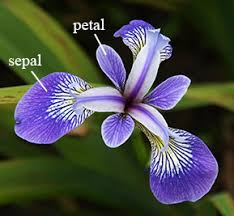
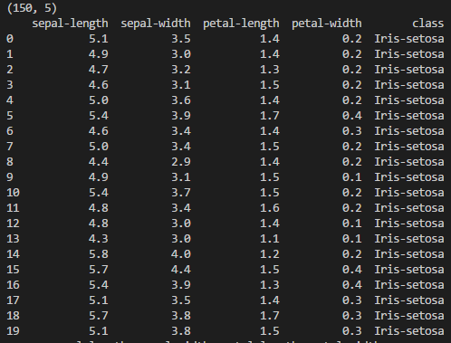
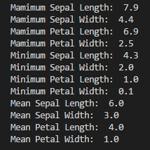
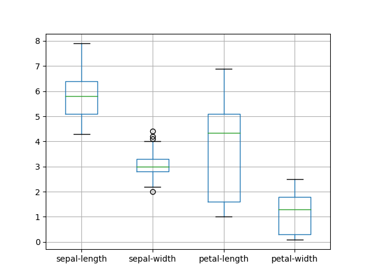
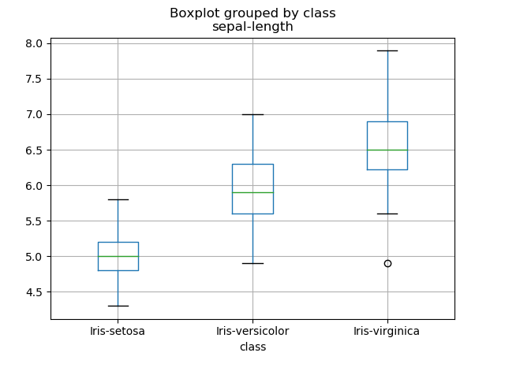

# Python Project 2018


##  Table_of_Contents


- [Introduction](#introduction)
- [Data Analysis Process](#data_analysis_process)
- [Visualise Results](#visualise_results)
- [Exploration and Analysis of Data](#exploration_of_data)
- [User Guide - Running Python Code](#user_guide)
- [Initial Coding Attempt](#initial_coding_attempt)
- [Research - Interesting Analysis from other sources](#research)
- [References](#references)


---

## Introduction
- The [Iris flower data set](./iris.csv) or Fisher's Iris data set is a multivariate data set introduced by the British statistician and biologist [Ronald Fisher](https://en.wikipedia.org/wiki/Ronald_Fisher) in his 1936 paper *The use of multiple measurements in taxonomic problems* as an example of [linear discriminant analysis](https://en.wikipedia.org/wiki/Linear_discriminant_analysis). It is sometimes called Anderson's Iris data set because Edgar Anderson collected the data to quantify the morphologic variation of Iris flowers of three related species. Two of the three species were collected in the Gaspé Peninsula "all from the same pasture, and picked on the same day and measured at the same time by the same person with the same apparatus" [1].

- The [data set](./iris.csv) consists of 50 samples from each of three species of Iris (Iris setosa, Iris virginica and Iris versicolor). Four features were measured from each sample: the length and the width of the sepals and petals, in centimetres. Based on Fisher's linear discriminant model, this data set became a typical test case for many statistical classification techniques in machine learning such as support vector machines [1].

<h3 align="center">Iris Versicolor &nbsp;&nbsp;&nbsp;&nbsp; &nbsp;&nbsp;&nbsp;&nbsp;  &nbsp;&nbsp;&nbsp;&nbsp; 
Iris Virginica &nbsp;&nbsp;&nbsp;&nbsp;  &nbsp;&nbsp;&nbsp;&nbsp; &nbsp;&nbsp;&nbsp;&nbsp;  Iris Setosa</h3>

<p align="center">
    
  
  
  

  
  
  </p>
  
 
  ***
  
## Data_Analysis_Process
* __Data Acquisition:__ The Comma Separated File containing [Iris Data Set](./iris.csv) is loaded with Python command *pandas.read_csv(url, names=names)*. We can see that the data in the first four columns is numeric without header information. Column names are assigned with command *names = ['sepal-length',...]*. The fifth column gives us the flower name associated with petal and sepal data for each row.


<details>
            <summary>Dataset example with code extract (Click to expand)</summary>

```
url = "iris.csv"
names = ['sepal-length', 'sepal-width', 'petal-length', 'petal-width', 'class']
dataset = pandas.read_csv(url, names=names)
   ```
   <p align="center">
    
  
  
  </p>
 </details>
 
* Data Description and Analysis
    * The objective of this step in the process is to understand the main characteristics of Iris Data Set and the nature of the information we are dealing with.
    * Quantative techniques such as Mean, Maximum and Minimum will be analysed
    * Three graphical technques will be used to visualise the data, Box Plots, Histograms and Scatter Plots.  
    * One of the key features of the data frame is that it consists of 5 columns, first four contain sepal/petal measurement in centimeters, the fifth contains flower type.
    * We can review these statistics and start noting interesting facts about our data set, such as;
        - The minimum sepal length is 3.3 centimeters greater than the minimum petal length.
        - From mean values we can establish that sepal is bigger than petal.
        - Count tells us that all four columns have 150 rows.
    * Import [Pandas](https://en.wikipedia.org/wiki/Pandas_(software)) and [NumPy](https://en.wikipedia.org/wiki/NumPy) from Python Data Analysis Library
    * [Pandas](https://en.wikipedia.org/wiki/Pandas_(software)) is an open source, BSD-licensed library providing high-performance, easy-to-use data structures and data analysis tools for the [Python](https://www.python.org/) programming language.
    * [NumPy](https://en.wikipedia.org/wiki/NumPy) is the fundamental package for scientific computing with Python.
    * Calculate and output Mean, Minimum and Maximum values. The initial calculations were done using straightforward python code. dataset['sepal-length'].max. Replacing .max in this expression with .min and .mean facilitates further calculations.
    * Further research on pandas methods provide a simpler way of calculating Min, Max, Mean using *describe()* function. Pandas *describe()* generates descriptive statistics that summarise the central tendency, dispersion and shape of a dataset’s distribution, excluding NaN values [2].  


<details>
            <summary>Line by line method - Code extract and output screenshot (Click to expand)</summary>
    
   ```
  # max column value using Pandas max() method
print("Mamimum Sepal Length: "),(dataset['sepal-length'].max())
print("Mamimum Sepal Width: "),(dataset['sepal-width'].max())
print("Mamimum Petal Length: "),(dataset['petal-length'].max())
print("Mamimum Petal Width: "),(dataset['petal-width'].max())
# minimum column value using Pandas min() method
print("Minimum Sepal Length: "),(dataset['sepal-length'].min())
print("Minimum Sepal Width: "),(dataset['sepal-width'].min())
print("Minimum Petal Length: "),(dataset['petal-length'].min())
print("Minimum Petal Width: "),(dataset['petal-width'].min())
# mean column value using Pandas mean() method
print("Mean Sepal Length: "),(round(dataset['sepal-length'].mean()))
print("Mean Sepal Width: "),(round(dataset['sepal-width'].mean()))
print("Mean Petal Length: "),(round(dataset['petal-length'].mean()))
print("Mean Petal Width: "),(round(dataset['petal-width'].mean()))
 ``` 

 

 * Result of Max, Min and Mean calculations:
  
 <p align="center">
    
  
  
  </p>
  
   </details>  
  
  <details>
  <summary>Pandas describe() method - Code extract and output screenshot ! (Click to expand)</summary>
    
    
 * A more efficient Pandas *describe()* method requires a single line of code. 
 * Parameters percentiles[..],include[..] and exclude[..] can be set as required.  
 
    
 ```
 print(dataset.describe(percentiles=[]))
 ```

 <p align="center">
    
  
  
 </p>
 
 </details> 
 
 <br/>
<div align="right">
    <b><a href="#table_of_contents">↥ back to top</a></b>
</div>
<br/>
 
 ***
  
## Visualise_Results

<details>
            <summary>Box Plot 1 (Click to expand)</summary>
    
    * The first diagram is a representation of the Iris data set in Box Plot [3] form. 
    * Pandas function [dataset.boxplot()](http://pandas.pydata.org/pandas-docs/version/0.17.0/generated/pandas.DataFrame.boxplot.html) gives us four box plots on a single graph. 
    * Data from each column is represented in box plot form. This gives us an insight into the uniqueness of each species of Iris.  
    * The data from each of the first four columns depicts graphically the groups of numerical data through their quartiles.
    * Key observations as follows: 
        - There is a greater variance in the spread of petal length compared to sepal length, suggesting non uniformity. 
        - Sepal width shows a small spread from mean value of 3.054. 
        - The 'outliers' in sepal width are due to three values above max of 4 cms and one value under min 2.2 cms.
    
    
    
  ```
  url = "iris.csv"
names = ['sepal-length', 'sepal-width', 'petal-length', 'petal-width', 'class']
dataset = pandas.read_csv(url, names=names)

# box and whisker plots
dataset.boxplot()
plt.show()


 ```
 
 <p align="center">
    
  
  
 </p>
 
 </details> 
 <details>
            <summary>Box Plot 2 (Click to expand)</summary>
    
    * The second Box Plot filters sepal length data * dataset.boxplot(column="sepal-length",by="class")* and is visualised per flower classification. 
        - There is a 1.5 variance in mean values between iris-setosa and iris-virginica
        - The spread of values is greater in Iris-virginica
        - The interquartile range (middle 50%) is similar across the three classifications
    
    
 ```
 url = "iris.csv"
names = ['sepal-length', 'sepal-width', 'petal-length', 'petal-width', 'class']
dataset = pandas.read_csv(url, names=names)

 dataset.boxplot(column="sepal-length",by="class")
 plt.show()


 ```
    
  <p align="center">
    
  
  
 </p>
    
 </details>    
 
 <details>
            <summary>What is a Box Plot? (Click to expand)</summary>
    
> A Box and Whisker Plot (or Box Plot) is a convenient way of visually displaying the data distribution through their quartiles.The lines extending parallel from the boxes are known as the “whiskers”, which are used to indicate variability outside the upper and lower quartiles. Outliers are sometimes plotted as individual dots that are in-line with whiskers [4]. 
>>Although Box Plots may seem primitive in comparison to a Histogram or Density Plot, they have the advantage of taking up less space, which is useful when comparing distributions between many groups or datasets.
>>>Box Plots are useful to view key values like average, 25th percentile, symmetry of data, and how tightly data is grouped. 
  
  
  <p align="center">
    
  
  
  </p>
    
 </details> 
 <br/>
<div align="right">
    <b><a href="#table_of_contents">↥ back to top</a></b>
</div>
<br/>
    
 ***
    

## User_Guide
1. The Python code for this project can be found in this repository in file [Python_Iris.py](./Python_Iris.py).
2. Required software - download and install [Anaconda](https://conda.io/docs/user-guide/install/download.html).
3. Create a new folder and download Python_Iris.py(./Python_Iris.py) plus Iris [data set](./iris.csv). Please make sure both files are located in same folder. 
4. Lauch Anaconda and click File -> open folder -> Locate and open folder containing Python_Iris.py.
<p align="center">
    
  
  
  </p>
  
 5. Click and open Python_Iris.py in left hand pane of window.
 <p align="center">
    
  
  
  </p>
  
  6. Click on Debug -> Start debugging -> select Python. The following data should appear in Terminal window
  <p align="center">
    
  
  
  </p>
  7. 
    


<br/>
<div align="right">
    <b><a href="#table_of_contents">↥ back to top</a></b>
</div>
<br/>
    
***
 
## Initial_Coding_Attempt
- Using Numpy, I calculated mean value of first three columns with np.mean(data). Python file [MeanofCols.py](./MeanofCols.py)

<details>
  <summary>Pandas describe() method - Code extract and output screenshot  (Click to expand)</summary>

```
data = pd.read_csv('iris.csv', header = None)
print (data)
#use comma to separate data intl columns
data = np.genfromtxt('iris.csv', delimiter = ",")
print (data[:,0:3])
#load data from first column into firstcol
firstcol = data[:,0]
secondcol = data[:,1]
thirdcol = data[:,2]
#calcuate mean of columns
meanfirstcol = np.mean(data[:,0])
print ("Mean value of first col is:", meanfirstcol)

meansecondcol = np.mean(data[:,1])
print ("Mean value of second col is:", meansecondcol)

meanthirdcol = np.mean(data[:,2])
print ("Mean value of third col is:", meanthirdcol)
```
</details>
<br/>
<div align="right">
    <b><a href="#table_of_contents">↥ back to top</a></b>
</div>
<br/>
***
## Exploration_of_Data

>this mght be useful
>>ver useful
>>>very useful indeed!!!

Table Header-1 | Table Header-2 | Table Header-3
:--- | :---: | ---:
Table Data-1 | Table Data-2 | Table Data-3
TD-4 | Td-5 | TD-6
Table Data-7 | Table Data-8 | Table Data-9

<br/>
<div align="right">
    <b><a href="#table_of_contents">↥ back to top</a></b>
</div>
<br/>

***

## Research

 >examples of interesting analyses that others have pursued based on the data set will be discussed.
 * Interesting analyses that others have pursued based on the Iris data set
    1. 
    2. 
    3. 
    


***

## References
1. Initial research on Iris Flower Data Set on Wikipedia https://en.wikipedia.org/wiki/Iris_flower_data_set. 
2. Pandas describe() method https://pandas.pydata.org/pandas-docs/stable/generated/pandas.DataFrame.describe.html
3. Data Analysis https://machinelearningmastery.com/quick-and-dirty-data-analysis-with-pandas/
4. Box and Whisker plots https://datavizcatalogue.com/methods/box_plot.html
5. 


