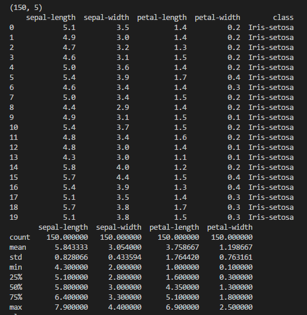

# Python Project 2018


##  Table_of_Contents


- [Introduction](#introduction)
- [Data Analysis Process](#data_analysis_process)
- [Visualise Data](#visualise_data)
- [Exploration of Data](#exploration_of_data)
- [Analysis](#analysis)
- [Initial Coding Attempt](#initial_coding_attempt)
- [References](#references)

---

## Introduction
- The [Iris flower data set](./iris.csv) or Fisher's Iris data set is a multivariate data set introduced by the British statistician and biologist [Ronald Fisher](https://en.wikipedia.org/wiki/Ronald_Fisher) in his 1936 paper *The use of multiple measurements in taxonomic problems* as an example of [linear discriminant analysis](https://en.wikipedia.org/wiki/Linear_discriminant_analysis). It is sometimes called Anderson's Iris data set because Edgar Anderson collected the data to quantify the morphologic variation of Iris flowers of three related species. Two of the three species were collected in the Gaspé Peninsula "all from the same pasture, and picked on the same day and measured at the same time by the same person with the same apparatus"

- The [data set](./iris.csv) consists of 50 samples from each of three species of Iris (Iris setosa, Iris virginica and Iris versicolor). Four features were measured from each sample: the length and the width of the sepals and petals, in centimetres. Based on Fisher's linear discriminant model, this data set became a typical test case for many statistical classification techniques in machine learning such as support vector machines. 

<h3 align="center">Iris Versicolor &nbsp;&nbsp;&nbsp;&nbsp; &nbsp;&nbsp;&nbsp;&nbsp;  &nbsp;&nbsp;&nbsp;&nbsp; 
Iris Virginica &nbsp;&nbsp;&nbsp;&nbsp;  &nbsp;&nbsp;&nbsp;&nbsp; &nbsp;&nbsp;&nbsp;&nbsp;  Iris Setosa</h3>

<p align="center">
    
  
  
  

  
  
  </p>
  
 
  ***
  
## Data_Analysis_Process
* Load dataset from Iris file. We can see that all of the data is numeric and that the class value on the end is the dependent variable that we want to analyse further.


<details>
            <summary>Dataset example with code extract (Click to expand)</summary>

```
url = "iris.csv"
names = ['sepal-length', 'sepal-width', 'petal-length', 'petal-width', 'class']
dataset = pandas.read_csv(url, names=names)
   ```
   <p align="center">
    
  
  
  </p>
 </details>
 
* Describe Data
    * The data frame consists of 150 rows and 5 columns.
    * We can review these statistics and start noting interesting facts about our the data set. 
    * Such as 
        - The minimum sepal length is 3.3 centimeters greater than the minimum petal length.
        - The maximum sepal length is 7.9 centimeters.
        - The average sepal length is 2.084 centimeters greater than the average petal length.
   
* Perform initial analysis
    * Import [Pandas](https://en.wikipedia.org/wiki/Pandas_(software)) and [NumPy](https://en.wikipedia.org/wiki/NumPy) from Python Data Analysis Library
    * [Pandas](https://en.wikipedia.org/wiki/Pandas_(software)) is an open source, BSD-licensed library providing high-performance, easy-to-use data structures and data analysis tools for the [Python](https://www.python.org/) programming language.
    * [NumPy](https://en.wikipedia.org/wiki/NumPy) is the fundamental package for scientific computing with Python.
    * Calculate and output Mean, Minimum and Maximum values. The initial calculations were done using straightforward python code. dataset['sepal-length'].max. Replacing .max in this expression with .min and .mean facilitates further calculations.


<details>
            <summary>Line by line method - Code extract and output screenshot (Click to expand)</summary>
    
   ```
  # max column value using Pandas max() method
print("Mamimum Sepal Length: "),(dataset['sepal-length'].max())
print("Mamimum Sepal Width: "),(dataset['sepal-width'].max())
print("Mamimum Petal Length: "),(dataset['petal-length'].max())
print("Mamimum Petal Width: "),(dataset['petal-width'].max())
# minimum column value using Pandas min() method
print("Minimum Sepal Length: "),(dataset['sepal-length'].min())
print("Minimum Sepal Width: "),(dataset['sepal-width'].min())
print("Minimum Petal Length: "),(dataset['petal-length'].min())
print("Minimum Petal Width: "),(dataset['petal-width'].min())
# mean column value using Pandas mean() method
print("Mean Sepal Length: "),(round(dataset['sepal-length'].mean()))
print("Mean Sepal Width: "),(round(dataset['sepal-width'].mean()))
print("Mean Petal Length: "),(round(dataset['petal-length'].mean()))
print("Mean Petal Width: "),(round(dataset['petal-width'].mean()))
 ``` 

 

 * Result of Max, Min and Mean calculations:
  
 <p align="center">
    
  
  
  </p>
  
   </details>  
  
  <details>
  <summary>Pandas describe() method - Code extract and output screenshot ! (Click to expand)</summary>
    
    
 * A more efficient Pandas *describe()* method requires a single line of code. 
 * Parameters percentiles[..],include[..] and exclude[..] can be set as required.  
 
    
 ```
 print(dataset.describe(percentiles=[]))
 ```

 <p align="center">
    
  
  
 </p>
 
 </details> 
 
 ***
  
## Visualise_Data

<details>
            <summary>Box Plot 1 (Click to expand)</summary>
    The following diagram is a representation of the Iris data set in Box Plot form. The spread of sepal length values is much smaller than petal length values. 
    
    
  ```
  url = "iris.csv"
names = ['sepal-length', 'sepal-width', 'petal-length', 'petal-width', 'class']
dataset = pandas.read_csv(url, names=names)

# box and whisker plots
dataset.boxplot()
plt.show()


 ```
 
 <p align="center">
    
  
  
 </p>
 
 </details> 
 <details>
            <summary>Box Plot 2 (Click to expand)</summary>
    
  The second box Plot 
    
    
    ```
    
 dataset.boxplot(column="sepal-length",by="class")
 plt.show()

    ```
    
  <p align="center">
    
  
  
 </p>
    
 </details>    
 
 <details>
            <summary>What is a Box Plot? (Click to expand)</summary>
    
> A Box and Whisker Plot (or Box Plot) is a convenient way of visually displaying the data distribution through their quartiles.The lines extending parallel from the boxes are known as the “whiskers”, which are used to indicate variability outside the upper and lower quartiles. Outliers are sometimes plotted as individual dots that are in-line with whiskers. 
>>Although Box Plots may seem primitive in comparison to a Histogram or Density Plot, they have the advantage of taking up less space, which is useful when comparing distributions between many groups or datasets.
>>>Box Plots are useful to view key values like average, 25th percentile, symmetry of data, and how tightly data is grouped. 
  
  
  <p align="center">
    
  
  
  </p>
    
 </details> 
    
 ***
    
## Analysis
    * Compare groups of data
    * Explore relationship between variables
    
***
 
## Initial_Coding_Attempt
- Using Numpy, I calculated mean value of first three columns with np.mean(data). Python file [MeanofCols.py](./MeanofCols.py)

<details>
  <summary>Pandas describe() method - Code extract and output screenshot ! (Click to expand)</summary>

```
data = pd.read_csv('iris.csv', header = None)
print (data)
#use comma to separate data intl columns
data = np.genfromtxt('iris.csv', delimiter = ",")
print (data[:,0:3])
#load data from first column into firstcol
firstcol = data[:,0]
secondcol = data[:,1]
thirdcol = data[:,2]
#calcuate mean of columns
meanfirstcol = np.mean(data[:,0])
print ("Mean value of first col is:", meanfirstcol)

meansecondcol = np.mean(data[:,1])
print ("Mean value of second col is:", meansecondcol)

meanthirdcol = np.mean(data[:,2])
print ("Mean value of third col is:", meanthirdcol)
```
</details>

***
## Exploration_of_Data

>this mght be useful
>>ver useful
>>>very useful indeed!!!

Table Header-1 | Table Header-2 | Table Header-3
:--- | :---: | ---:
Table Data-1 | Table Data-2 | Table Data-3
TD-4 | Td-5 | TD-6
Table Data-7 | Table Data-8 | Table Data-9

<br/>
<div align="right">
    <b><a href="#table_of_contents">↥ back to top</a></b>
</div>
<br/>

***

## References
* Initial research on Iris Flower Data Set on Wikipedia https://en.wikipedia.org/wiki/Iris_flower_data_set. 
* Box and Whisker plots https://datavizcatalogue.com/methods/box_plot.html


