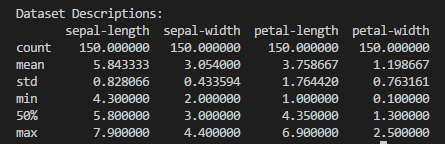

# Python Project 2018


##  Table_of_Contents


- [Introduction](#introduction)
- [Data Analysis](#data_analysis)
- [Visualise Results](#visualise_results)
- [User Guide - Running Python Code](#user_guide)
- [Research - Interesting Analysis from other sources](#research)
- [References](#references)


---

## Introduction
- The [Iris flower data set](./iris.csv) or Fisher's Iris data set is a multivariate data set introduced by the British statistician and biologist [Ronald Fisher](https://en.wikipedia.org/wiki/Ronald_Fisher) in his 1936 paper *The use of multiple measurements in taxonomic problems* as an example of [linear discriminant analysis](https://en.wikipedia.org/wiki/Linear_discriminant_analysis). It is sometimes called Anderson's Iris data set because Edgar Anderson collected the data to quantify the morphologic variation of Iris flowers of three related species. Two of the three species were collected in the Gaspé Peninsula "all from the same pasture, and picked on the same day and measured at the same time by the same person with the same apparatus" [1].

- The [data set](./iris.csv) consists of 50 samples from each of three species of Iris (Iris setosa, Iris virginica and Iris versicolor). Four features were measured from each sample: the length and the width of the sepals and petals, in centimetres. Based on Fisher's linear discriminant model, this data set became a typical test case for many statistical classification techniques in machine learning such as support vector machines [1].


<h3 align="center">Iris Versicolor &nbsp;&nbsp;&nbsp;&nbsp; &nbsp;&nbsp;&nbsp;&nbsp;  &nbsp;&nbsp;&nbsp;&nbsp; 
Iris Virginica &nbsp;&nbsp;&nbsp;&nbsp;  &nbsp;&nbsp;&nbsp;&nbsp; &nbsp;&nbsp;&nbsp;&nbsp;  Iris Setosa</h3>

<p align="center">
    
  
  
  

  
  
  </p>
  
 
  ***
  
## Data_Analysis
* __Data Acquisition:__ The Comma Separated Raw Data File containing [Iris Data Set](./iris.csv) is loaded with Python command *pandas.read_csv(url, names=names)*. 
* We can see that the data in the first four columns is numeric without header information. Column names are assigned with command *names = ['sepal-length',...]*. 
* The fifth attribute *'class'* gives us the flower name associated with petal and sepal data.

<details>
            <summary>Dataset example with code extract...............(Click to expand)</summary>

```
url = "iris.csv"
names = ['sepal-length', 'sepal-width', 'petal-length', 'petal-width', 'class']
dataset = pandas.read_csv(url, names=names)
   ```
   <p align="center">
    
  
  
  </p>
 </details>
 
* __Data Description and Processing__
    * The objective of this step in the process is to understand the main characteristics of Iris Data Set and the nature of the information we are dealing with.
    * Quantative techniques such as Mean, Maximum and Minimum will be analysed
    * Three graphical technques will be used to visualise the data, Box Plots, Histograms and Scatter Plots.  
    * One of the key features of the data frame is that it consists of 5 columns, first four contain sepal/petal measurement in centimeters, the fifth contains text relating to flower type.
    * We can review these statistics and start noting interesting facts about our data set, such as;
        - The minimum sepal length is 3.3 centimeters greater than the minimum petal length.
        - From mean values we can establish that sepal is bigger than petal.
        - Count tells us that all four columns have 150 rows.
    * Import [Pandas](https://en.wikipedia.org/wiki/Pandas_(software)) and [NumPy](https://en.wikipedia.org/wiki/NumPy) from Python Data Analysis Library
    * [Pandas](https://en.wikipedia.org/wiki/Pandas_(software)) is an open source, BSD-licensed library providing high-performance, easy-to-use data structures and data analysis tools for the [Python](https://www.python.org/) programming language.
    * [NumPy](https://en.wikipedia.org/wiki/NumPy) is the fundamental package for scientific computing with Python.
    * Calculate and output Mean, Minimum and Maximum values. The initial calculations were done using straightforward python code. dataset['sepal-length'].max. Replacing .max in this expression with .min and .mean facilitates further calculations.
    * Further research on pandas methods provide a simpler way of calculating Min, Max, Mean using *describe()* function. Pandas *describe()* generates descriptive statistics that summarise the central tendency, dispersion and shape of a dataset’s distribution, excluding NaN values [2].  


<details>
            <summary>Line by line method - Code extract and output screenshot........ (Click to expand)</summary>
    
   ```
  # max column value using Pandas max() method
print("Mamimum Sepal Length: "),(dataset['sepal-length'].max())
print("Mamimum Sepal Width: "),(dataset['sepal-width'].max())
print("Mamimum Petal Length: "),(dataset['petal-length'].max())
print("Mamimum Petal Width: "),(dataset['petal-width'].max())
# minimum column value using Pandas min() method
print("Minimum Sepal Length: "),(dataset['sepal-length'].min())
print("Minimum Sepal Width: "),(dataset['sepal-width'].min())
print("Minimum Petal Length: "),(dataset['petal-length'].min())
print("Minimum Petal Width: "),(dataset['petal-width'].min())
# mean column value using Pandas mean() method
print("Mean Sepal Length: "),(round(dataset['sepal-length'].mean()))
print("Mean Sepal Width: "),(round(dataset['sepal-width'].mean()))
print("Mean Petal Length: "),(round(dataset['petal-length'].mean()))
print("Mean Petal Width: "),(round(dataset['petal-width'].mean()))
 ``` 

 

 * Result of Max, Min and Mean calculations:
  
 <p align="center">
    
  
  
  </p>
  
   </details>  
  
  <details>
  <summary>Pandas describe() method - Code extract and output screenshot............. (Click to expand)</summary>
    
    
 * A more efficient Pandas *describe()* method requires a single line of code. 
 * Parameters percentiles[..],include[..] and exclude[..] can be set as required.  
 
    
 ```
 print(dataset.describe(percentiles=[]))
 ```

 <p align="center">
    
  
  
 </p>
 
 </details> 
 
 <br/>
<div align="right">
    <b><a href="#table_of_contents">↥ back to top</a></b>
</div>
<br/>
 
 ***
  
## Visualise_Results
* __Data Visualisation__ involves the creation and study of the visual representation of data. The primary goal is to communicate information clearly and efficiently [5]. 
* I have chosen three graphical technques to visualise the data;
    - Box Plot - convenient way of visually displaying the data distribution through their quartiles [4]. 
    - Histogram - allows you discover, and show the underlying frequency distribution of a set of continuous data[6].
    - Scatter Plot - uses dots to represent individual pieces of data on x-y axis.


<details>
            <summary>Box Plot 1 - each column is represented................(Click to expand)</summary>
    
    * The first diagram is a representation of the Iris data set in Box Plot form. 
    * Pandas function [dataset.boxplot()](http://pandas.pydata.org/pandas-docs/version/0.17.0/generated/pandas.DataFrame.boxplot.html) gives us four box plots on a single graph. 
    * Data from each column is represented in box plot form. This gives us an insight into the uniqueness of each species of Iris.  
    * The data from each of the first four columns depicts graphically the groups of numerical data through their quartiles.
    * Key observations as follows: 
        - There is a greater variance in the spread of petal length compared to sepal length, suggesting non uniformity. 
        - Sepal width shows a small spread from mean value of 3.054. 
        - The 'outliers' in sepal width are due to three values above max of 4 cms and one value under min 2.2 cms.
    
    
    
  ```
  url = "iris.csv"
names = ['sepal-length', 'sepal-width', 'petal-length', 'petal-width', 'class']
dataset = pandas.read_csv(url, names=names)

# box and whisker plots
dataset.boxplot()
plt.show()


 ```
 
 <p align="center">
    
  
  
 </p>
 
 </details> 
 <details>
            <summary>Box Plot 2 - sepal length per flower type..................(Click to expand)</summary>
    
    * The second Box Plot filters sepal length data * dataset.boxplot(column="sepal-length",by="class")* and is visualised per flower classification. 
        - There is a 1.5 variance in mean values between iris-setosa and iris-virginica
        - The spread of values is greater in Iris-virginica
        - The interquartile range (middle 50%) is similar across the three classifications
    
    
 ```
 url = "iris.csv"
names = ['sepal-length', 'sepal-width', 'petal-length', 'petal-width', 'class']
dataset = pandas.read_csv(url, names=names)

 dataset.boxplot(column="sepal-length",by="class")
 plt.show()


 ```
    
  <p align="center">
    
  
  
 </p>
    
 </details>    
 
 <details>
            <summary>What is a Box Plot?........................................................ (Click to expand)</summary>
    
> A Box and Whisker Plot (or Box Plot) is a convenient way of visually displaying the data distribution through their quartiles.The lines extending parallel from the boxes are known as the “whiskers”, which are used to indicate variability outside the upper and lower quartiles. Outliers are sometimes plotted as individual dots that are in-line with whiskers [4]. 
>>Although Box Plots may seem primitive in comparison to a Histogram or Density Plot, they have the advantage of taking up less space, which is useful when comparing distributions between many groups or datasets.
>>>Box Plots are useful to view key values like average, 25th percentile, symmetry of data, and how tightly data is grouped. 
  
  
  <p align="center">
    
  
  
  </p>
   </details>   
 <details>
            <summary>Histogram example.............................................................. (Click to expand)</summary>  
    
 * __Histogram__
 
 
    
```    
# Use Pandas histograms .hist() to plot standard histogram of Iris Data Set
DataFrame.hist()
plt.show()

    
 ```
 
   <p align="center">
    
  
  
  </p> 
  </details>  
 <details>
            <summary>Scatter Plot Diagram....................................................... (Click to expand)</summary>  
    
 * __Scatter Plot Diagram__: A scatter plot diagram is a mathematical diagram which displayes values (typically 2 variables) for a set of data. The first diagram uses the *scatter_matrix* method from Pandas and plots the data from the four columns.  
 
 
 
    
```    
# scatter plot matrix with data from csv file
scatter_matrix(DataFrame)
plt.show()

    
 ```
 
   <p align="center">
    
  
  
  </p>
    
     

 <br/>
<div align="right">
    <b><a href="#table_of_contents">↥ back to top</a></b>
</div>
<br/>
</details>  

<details>
            <summary>Interesting Research - Scatter Plot Diagram.................. (Click to expand)</summary>  
    
 * __Scatter Plot Diagram__: I found the following code while researching scatter plot diagrams. This is a very interesting way of visualising two dimensional scatter plot diagrams because a third dimension/colour can be added to show the class of flower[6]. 
 * The first extract from code loads data from sklearn.datasets. x_index takes data from column 1 and y_index takes data from column 2 (sepal length and sepal width). The x and y give us a two dimensional array *plt.scatter(iris.data[:, x_index], iris.data[:, y_index], c=iris.target)*. The next significant feature is the target array *iris.target* the flower types ('setosa' 'versicolor' 'virginica'). 
    
  ```
# Load the data
from sklearn.datasets import load_iris
iris = load_iris()

from matplotlib import pyplot as plt

# The indices of the features that we are plotting
x_index = 0
y_index = 1

# this formatter will label the colorbar with the correct target names
formatter = plt.FuncFormatter(lambda i, *args: iris.target_names[int(i)])

plt.figure(figsize=(5, 4))
plt.scatter(iris.data[:, x_index], iris.data[:, y_index], c=iris.target)
plt.colorbar(ticks=[0, 1, 2], format=formatter)
plt.xlabel(iris.feature_names[x_index])
plt.ylabel(iris.feature_names[y_index])

plt.tight_layout()
plt.show()
```

<p align="center">
    
  
  
  </p> 
* The second extract from code loads data from sklearn.datasets. x_index takes data from column 3 and y_index takes data from column 4 (petal length and petal width).

```
# The indices of the features that we are plotting
x_index = 2
y_index = 3

# this formatter will label the colorbar with the correct target names
formatter = plt.FuncFormatter(lambda i, *args: iris.target_names[int(i)])

plt.figure(figsize=(5, 4))
plt.scatter(iris.data[:, x_index], iris.data[:, y_index], c=iris.target)
plt.colorbar(ticks=[0, 1, 2], format=formatter)
plt.xlabel(iris.feature_names[x_index])
plt.ylabel(iris.feature_names[y_index])

plt.tight_layout()
plt.show()

 ```
 
 <p align="center">
    
  
  
  </p> 
 
 
 <br/>
<div align="right">
    <b><a href="#table_of_contents">↥ back to top</a></b>
</div>
<br/>
</details>

 ***
    

## User_Guide
<details>
            <summary>Instructions to users............................. (Click to expand)</summary>
    
1. The Python code for this project can be found in this repository in file [Python_Iris.py](./Python_Iris.py).
2. Required software - download and install [Anaconda](https://conda.io/docs/user-guide/install/download.html).
3. Create a new folder and download Python_Iris.py(./Python_Iris.py) plus Iris [data set](./iris.csv). Please make sure both files are located in same folder. 
4. Lauch Anaconda and click File -> open folder -> Locate and open folder containing Python_Iris.py.
<p align="center">
    
  
  
  </p>
  
 5. Click and open Python_Iris.py in left hand pane of window.
 <p align="center">
    
  
  
  </p>
  
  6. Click on Debug -> Start debugging -> select Python. The following data should appear in Terminal window
  <p align="center">
    
  
  
  </p>
  7. 
    


<br/>
<div align="right">
    <b><a href="#table_of_contents">↥ back to top</a></b>
</div>
<br/>
    
</details>

***
 

## Research
 
 <details>
            <summary>Additional research - Data Analysis Algorithms............................. (Click to expand)</summary>
    
* I found the __kNN algorithm__ intuitive, interesting and easy to use and understand. KNN falls in the supervised learning family of algorithms. It is a non parametric, instance-based learning algorithm. [12] 

    - Non-parametric means it makes no explicit assumptions about the functional form of h, avoiding the dangers of mismodeling the underlying distribution of the data. For example, suppose our data is highly non-Gaussian but the learning model we choose assumes a Gaussian form. In that case, our algorithm would make extremely poor predictions. [12]
    - Instance-based learning means that our algorithm doesn’t explicitly learn a model. Instead, it chooses to memorize the training instances which are subsequently used as “knowledge” for the prediction phase. Concretely, this means that only when a query to our database is made (i.e. when we ask it to predict a label given an input), will the algorithm use the training instances to spit out an answer. [12]
    
     
* The analysis from a kNN Wikipedia example shows that a kNN classifier makes few mistakes in a dataset that, although simple, is not linearly separable, as shown in the scatterplots and by a look at the confusion matrix, where all misclassifications are between Iris Versicolor and Iris Virginica instances. The case study also shows how RWeka makes it trivially easy to learn classifiers (and predictors, and clustering models as well), and to experiment with their parameters. In this classic dataset, a kNN classifier makes very few mistakes.[11]
       
* __Supervised learning:__ is the machine learning task of learning a function that maps an input to an output based on example input-output pairs. It infera a function from labled training data consisting of training examples. Each example consists of an input object and a desired output. A supervised learning algorithm analyses the trining data and produces an inferred function[8].  

*  __Machine Learning.__ k-Nearest Neighbors algorithm is a method used for classification and regression. The k-NN algorithm is among the simplest of all machine learning algorithms [10]. This is the simplest machine learning algorithm. To make a prediction for the new data point, the algorithm finds the closest data points in the training data set. k-NN can be used both for classification and for regression tasks.
    - An objest is *classified* by a majority vote of its neighbors, with the object being assigned to the class most common among its k nearest neighbors. For the purpose of this research we have three target classes — Setosa, Virginica and Versicolour.
    - In k-NN *regression*, the output is the property value for the object. This value is the average of the values of its k nearest neighbors.
    
* __Classification__ In the simplest version k-NN takes the closest point from the training set and assigns it’s class to a new predicting point. Instead of considering only the closest neighbor, we can also consider an arbitrary number of neighbors — k-nearest. We use voting to assign the label. For each test point we count how many neighbors belong to each class and assign the class that is more frequent[10].
<p align="center">
    
  
  
  </p>
  

* __Regression.__ There is also a regression variant of k-NN algorithm. Let’s look at how it will use training set to make a prediction. When using multiple nearest neighbors, the prediction is average, or mean, of the relevant neighbors. Score method for the regression returns R² score — coefficient of determination and yields a score between 0 and 1. 1 — is a perfect prediction and 0 — constant model that predicts the mean of the training set responses. [10]
 
    
 <p align="center">
    
  
  
  </p>   
    
    
   
 <br/>
<div align="right">
    <b><a href="#table_of_contents">↥ back to top</a></b>
</div>
<br/>

</details>

***

## References

    [1] Initial research on Iris Flower Data Set on Wikipedia https://en.wikipedia.org/wiki/Iris_flower_data_set. 
    [2] Pandas describe() method https://pandas.pydata.org/pandas-docs/stable/generated/pandas.DataFrame.describe.html
    [3] Data Analysis https://machinelearningmastery.com/quick-and-dirty-data-analysis-with-pandas/
    [4] Box and Whisker plots https://datavizcatalogue.com/methods/box_plot.html
    [5] Data Visualisation https://en.wikipedia.org/wiki/Data_visualization
    [6] Scatter Plot Research http://www.scipy-lectures.org/packages/scikit-learn/auto_examples/plot_iris_scatter.html
    [7] Research - Supervised Learning http://scikit-learn.org/stable/tutorial/statistical_inference/supervised_learning.html
    [8] Supervised learning https://en.wikipedia.org/wiki/Supervised_learning
    [9] Machine Learning Nearest Neighbour https://towardsdatascience.com/learning-machine-learning-petals-32c68673d8fc
    [10] k Nearest Neighbour https://en.wikipedia.org/wiki/K-nearest_neighbors_algorithm
    [11] kNN - Wikipedia  https://en.wikibooks.org/wiki/Data_Mining_Algorithms_In_R/Classification/kNN
    [12] kNN Supervised Learning https://kevinzakka.github.io/2016/07/13/k-nearest-neighbor/

<br/>
<div align="right">
    <b><a href="#table_of_contents">↥ back to top</a></b>
</div>
<br/>

***
__Initial Coding__
<details>
            <summary>Early code example (Click to expand)</summary>
    
    - Import and load data with *data = np.genfromtxt('iris.csv', delimiter = ",")*.
    - Separate data into different columns *firstcol = data[:,0]*.
    - Using Numpy, I calculated mean value of first three columns with *np.mean(data)*. Python file [MeanofCols.py](./MeanofCols.py)

```
data = pd.read_csv('iris.csv', header = None)
print (data)
#use comma to separate data intl columns
data = np.genfromtxt('iris.csv', delimiter = ",")
print (data[:,0:3])
#load data from first column into firstcol
firstcol = data[:,0]
secondcol = data[:,1]
thirdcol = data[:,2]
#calcuate mean of columns
meanfirstcol = np.mean(data[:,0])
print ("Mean value of first col is:", meanfirstcol)

meansecondcol = np.mean(data[:,1])
print ("Mean value of second col is:", meansecondcol)

meanthirdcol = np.mean(data[:,2])
print ("Mean value of third col is:", meanthirdcol)
```


<br/>
<div align="right">
    <b><a href="#table_of_contents">↥ back to top</a></b>
</div>
<br/>
</details>


